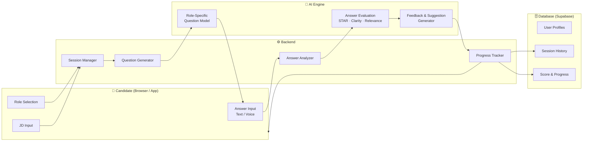
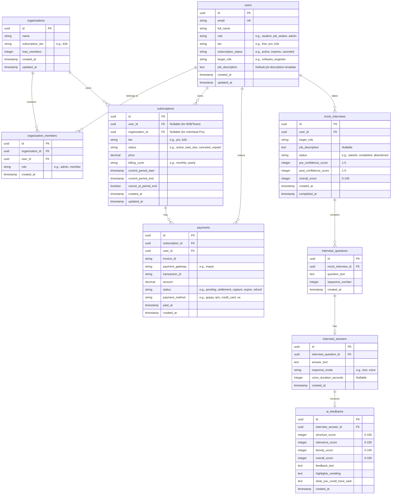
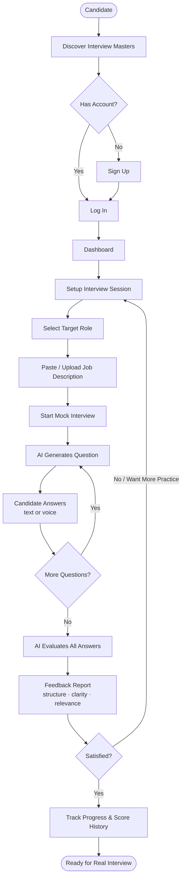
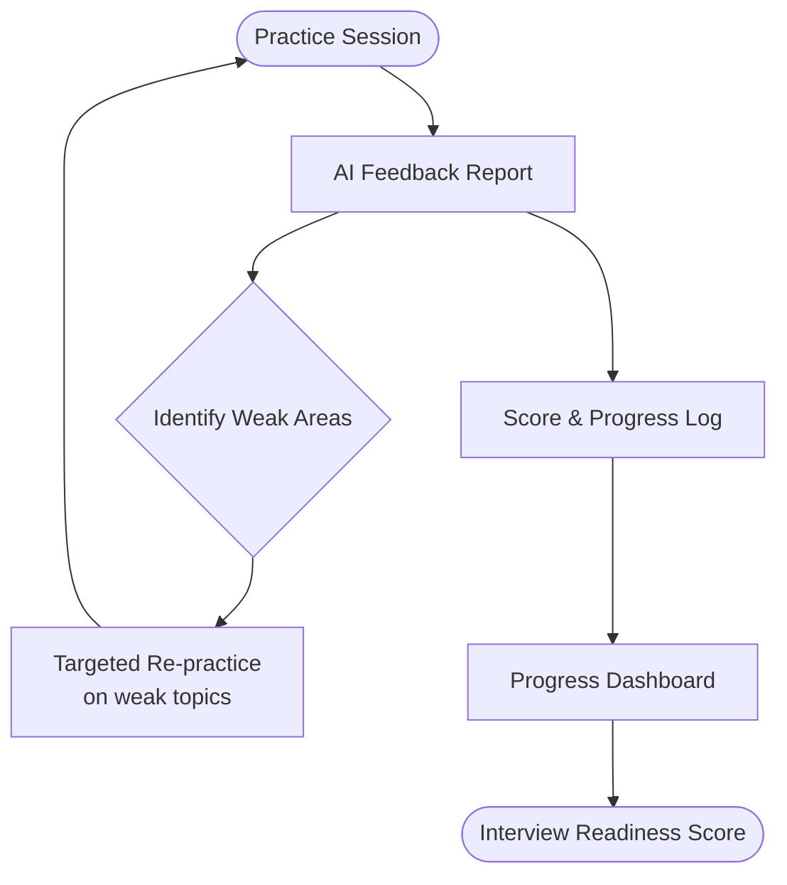
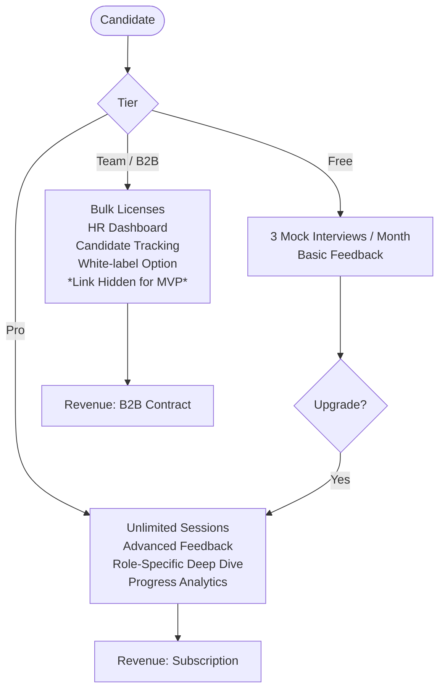
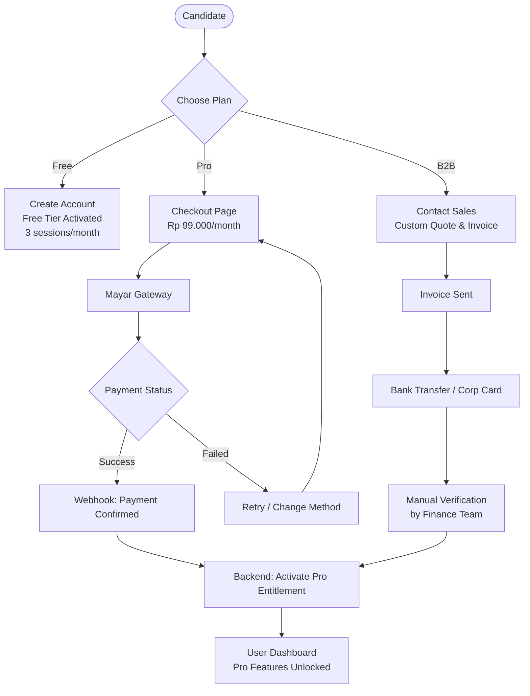
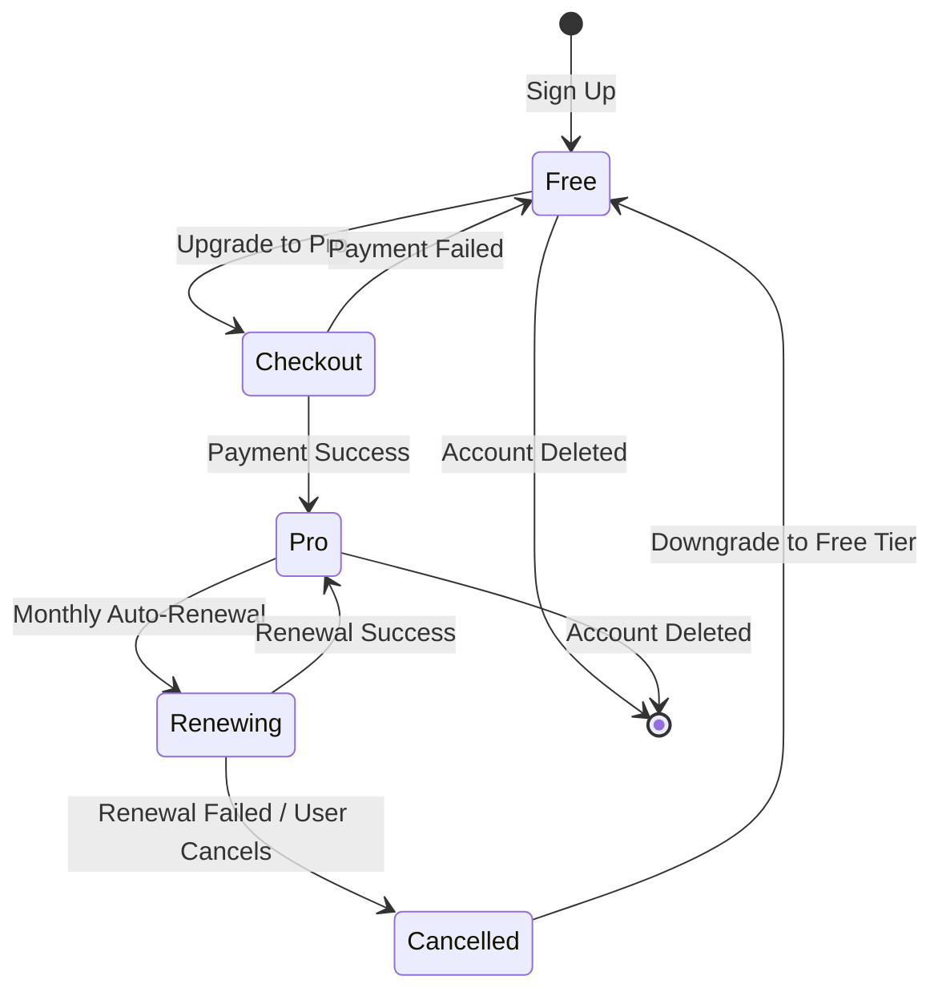

# 🎯 Interview Masters

> **AI-powered mock interview practice** — turning every candidate's real ability into real career opportunities.

---

## Table of Contents

1. [Vision & Founder Why](#1-vision--founder-why)
2. [Target Customer & User Persona](#2-target-customer--user-persona)
3. [MVP Hypothesis & Prototype](#3-mvp-hypothesis--prototype)
4. [Key MVP Features](#4-key-mvp-features)
5. [System Architecture](#5-system-architecture)
6. [Business Flow Diagrams](#6-business-flow-diagrams)
7. [Monetization & Payment System](#7-monetization--payment-system)
8. [Success Metrics](#8-success-metrics)
9. [Documentation](#9-documentation)

---

## 1. Vision & Founder Why

### 🔴 Problem
Interviews are high-pressure, unfair gatekeepers of opportunity. Many capable candidates fail to showcase their true potential — not because they lack ability, but because they lack **structured practice**, **immediate feedback**, and **confidence under pressure**. Today, interview coaching is either too expensive, too generic, or unavailable when people need it most.

### 💡 Core Belief
Many individuals are fully qualified and capable but fail to perform effectively under traditional interview conditions.

### ⚡ Why Now?
AI technology enables realistic, personalized, and highly scalable mock interview practice with instant feedback — which was previously either too expensive or inaccessible.

### 🚀 Mission
To help candidates transform their actual ability into real career opportunities by making interview preparation **accessible**, **measurable**, and **outcome-driven**.

---

## 2. Target Customer & User Persona

### Primary Persona
A **24-year-old recent college graduate** applying for their first serious full-time professional role.

| Attribute | Detail |
|---|---|
| Background | Strong GPA, relevant projects & internship experience |
| Interview Experience | Low — lacks exposure to high-pressure live professional interviews |
| Preparation Method | YouTube videos, static question lists (passive, unstructured) |
| Feedback Access | No coach; friends can only help occasionally |
| Core Feeling | "I could have done better, but I don't know exactly how" |

### Core Pain Points

- **Unstructured Preparation** — Passive resources (YouTube, question lists) don't build real-time communication skills.
- **Delivery & Formatting** — Struggles with rambling, structuring answers (STAR method), and connecting experience to the role.
- **Feedback Deficit** — No access to professional career coaches; peer feedback is brief and subjective.
- **Anxiety & Lack of Confidence** — Exits interviews with a vague sense of underperformance and no actionable path to improve.

---

## 3. MVP Hypothesis & Prototype

### Hypothesis
> If we provide candidates with a **realistic, interactive, and repeatable mock interview environment** powered by role-specific AI, they will build structured communication habits and increase their self-confidence — leading to higher interview pass rates.

### First Prototype
- **Platform URL**: https:// *(To Be Determined)*
- **Tech Stack**:
  - **Frontend**: Astro (Landing Page), React / Vite (Dashboard)
  - **Backend**: Hono (Node.js/TypeScript)
  - **Database**: Supabase (PostgreSQL)
- **Core Functionality**:
  - Role-specific interactive question generation
  - Voice-only mock response capture
  - Actionable feedback on structure, clarity, and relevance

---

## 4. Key MVP Features

### A. Role Selection & Interview Context Setup
- Select target role (e.g., Software Engineer, Product Manager, Marketing Associate).
- Upload or paste the job description to personalize the question set.

### B. Interactive Mock Interview Session
- AI generates questions sequentially based on role and JD.
- Candidates respond via voice only (text-chat mode removed for strict voice focus).
- Realistic pacing that simulates a real interview flow.

### C. Instant AI Feedback Engine
- Analyzes answers for structure (STAR method), relevance, and brevity.
- Highlights rambling or points lacking specific evidence.
- Provides a revised version — *"What you could have said"* — to guide improvement.

### D. Voice-Enabled Backend Services & APIs (Hono / Node.js)
- **Architecture**: TypeScript codebase powered by Hono for HTTP API routing and Node's native websocket capabilities for real-time streams.
- **Core AI Voice Flow**: User voice input transcribed to text at frontend → Sent over WebSocket to backend → LLM/Chat Engine generates response → Sent back to frontend → Read aloud via text-to-speech.
- REST HTTP Endpoints:
  - `GET /health` - Health check endpoint.
  - `POST /payments/create-checkout` - Generates a secure checkout payment link using Mayar API based on target plan (Pro or 14-Day Sprint).
  - `POST /webhook/mayar` - Receives payment status updates from Mayar, validates transaction signatures, updates user tiers, and syncs history.
- **WebSocket Endpoint**:
  - `WS /ws/voice` - Real-time interview session using WebSocket connection handling events like `session.started`, `user.transcript`, `assistant.text`, and `error`.

---

## 5. System Architecture

### Database Schema (ERD)

---

## 6. Business Flow Diagrams

### User Journey

### Feedback Loop & Improvement Cycle

### Business Model

---

## 7. Monetization & Payment System

### Pricing Tiers

| Tier | Price | Quota | Target User |
|---|---|---|---|
| **Free** | Rp 0 / month | 3 mock interviews/month, basic feedback | First-time users, students |
| **Pro** | Rp 99.000 / month | Unlimited sessions, advanced AI feedback, progress analytics, role deep-dive | Active job seekers |
| **14-Day Sprint** | Rp 390.000 / package | Masa aktif program 14 hari, umpan balik instan & terstruktur, posisi spesifik & kustom | Job seekers dengan jadwal wawancara ketat |
| **Team / B2B** *(Link Hidden for MVP)* | Custom | Bulk licenses, HR dashboard, candidate tracking, white-label | Bootcamps, universities, enterprise HR |

### Payment System Flow

### Subscription Lifecycle

### Payment Gateways
- 🇮🇩 **Primary Subscription Billing**: Mayar — supports local Indonesian payment methods (QRIS, VA, credit cards, e-wallets) with native integration.

### Refund & Cancellation Policy
- Pro users can cancel anytime; access remains until end of the billing cycle.
- Refund available within **3 days** of first charge if no sessions were consumed.

---

## 8. Success Metrics

| Metric | Description |
|---|---|
| **Completion Rate** | % of users who finish a started mock interview |
| **Repeat Engagement** | Number of mock interviews practiced per user |
| **Performance Progression** | Average improvement score across multiple sessions |
| **Confidence Rating** | Self-reported confidence score before vs. after practice |

---

## 9. Documentation

| File | Description |
|---|---|
| [docs/PRD.md](./docs/PRD.md) | Full Product Requirements Document |
| [docs/DIAGRAM.md](./docs/DIAGRAM.md) | All business flow diagrams |
| [docs/ERD.md](./docs/ERD.md) | Database Entity Relationship Diagram (ERD) |
