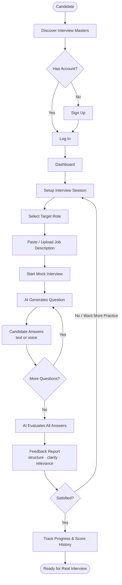
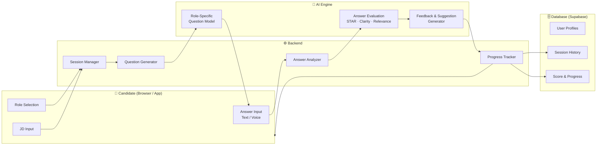
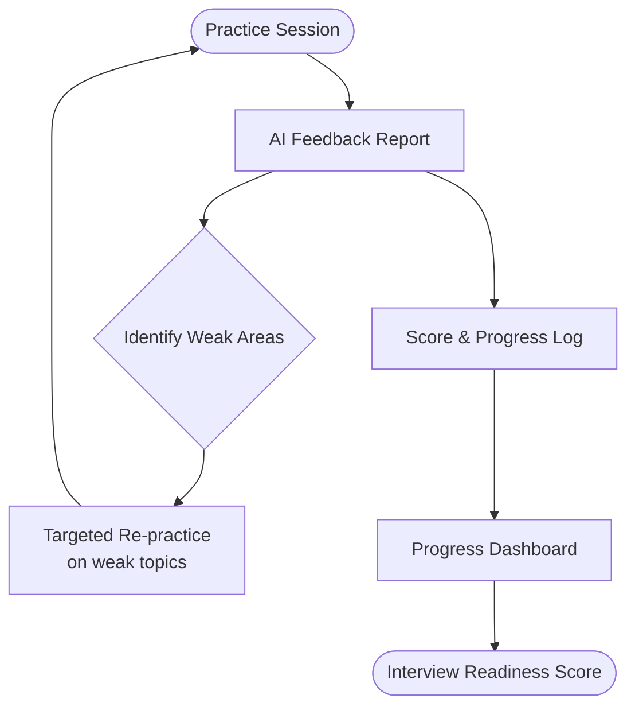
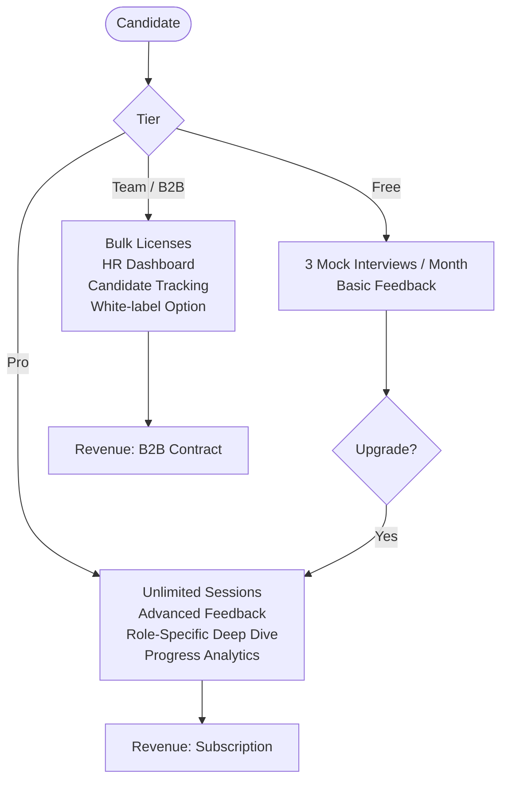
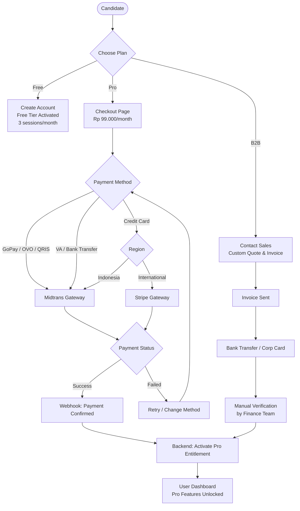
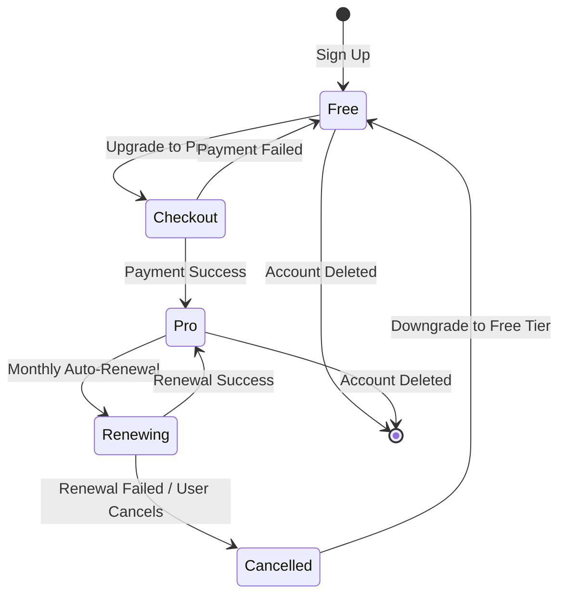

# Interview Masters — Business Flow Diagrams

## 1. High-Level User Journey

---

## 2. System Architecture Flow

---

## 3. Feedback Loop & Improvement Cycle

---

## 4. Business Model Flow

---

## 5. Payment System Flow

---

## 6. Subscription Lifecycle

