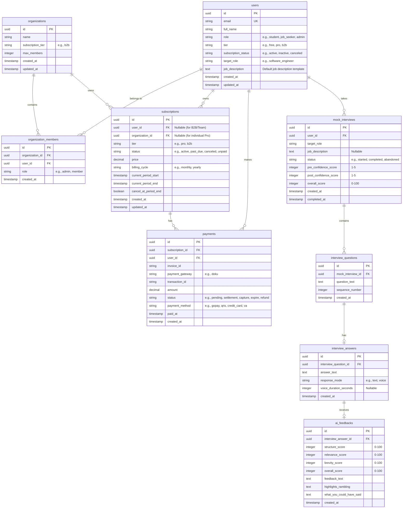

# Entity Relationship Diagram (ERD) - Interview Masters

Based on the [Product Requirement Document (PRD)](file:///Users/vickyadifirmansyah/Documents/Projects/interview-masters/docs/PRD.md), this document details the database design for **Interview Masters** using Supabase (PostgreSQL).

## Database Schema (Mermaid ERD)

## Entity Descriptions

### 1. User & Organization Management
- **`users`**: Represents individuals using the platform. Tiers are defined here to quickly identify accessibility (Free, Pro, B2B).
- **`organizations`**: Necessary for B2B/Team licenses. Groups users under a unified billing quota.
- **`organization_members`**: Junction table mapping users to their respective B2B organizations.

### 2. Billing & Payments
- **`subscriptions`**: Tracks the subscription status (active, canceled, past_due) and the renewal dates for both users (Pro) and organizations (B2B).
- **`payments`**: Records transactional logs coming from DOKU webhooks. Essential for refund processing and tracking monetization.

### 3. Interview Sessions & Analytics
- **`mock_interviews`**: Represents a single mock interview practice session. Contains user feedback like pre- and post-confidence scores to track self-reported progression.
- **`interview_questions`**: Questions generated sequentially for a specific interview session.
- **`interview_answers`**: Candidate responses, supporting both text and speech-to-text inputs.
- **`ai_feedbacks`**: The resulting analysis showing ratings on the STAR method structure, brevity, and relevance, along with suggestions.
